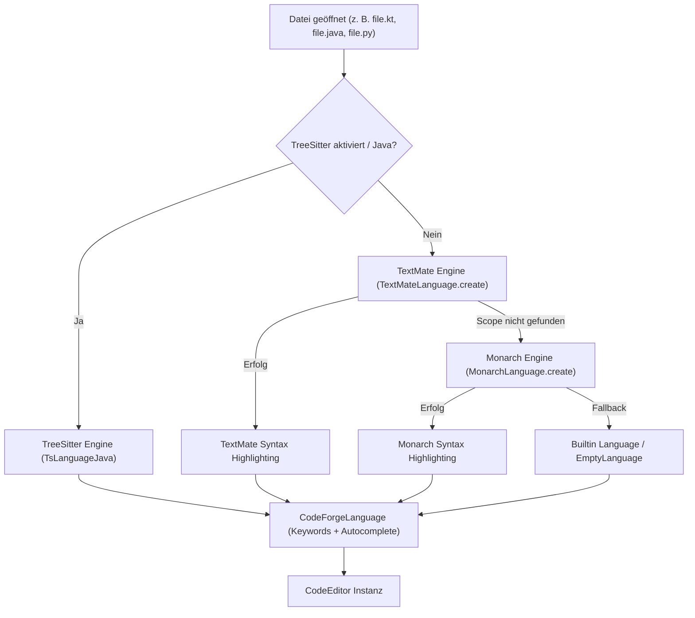

# CodeForge Mobile – Editor & FileTree Architektur-Dokumentation

Diese Dokumentation beschreibt die vollständige Integration der **TextMate/Monarch/TreeSitter-Engines**, das dynamische Einlesen von `languages.json` & `keywords.json`, das **Theme-System** (App & Editor) sowie die **Live-Refresh-Mechanismen** für Editor und FileTree.

---

## 1. TextMate & Syntax-Highlighting Architektur

Im Verzeichnis `feature/editor/src/main/assets/textmate/` befinden sich die Konfigurations- und Theme-Dateien für die TextMate-Engine:

- **`languages.json`**: Definiert alle unterstützten Sprachen, deren `scopeName`, Pfad zur Grammatik (`.tmLanguage.json`) sowie zugehörige Dateiendungen (`fileExtensions`).
- **`keywords.json`**: Mappt `scopeName` -> Keyword-Array für das Kontext-Autocompletion-System.
- **Theme-Dateien (`.json`)**: Enthalten Token-Farben und Editor-Farben (u. a. `codeforge.json`, `darcula.json`, `quietlight.json`, `ayu_dark.json`, `ayu_light.json`, `ayu_mirage.json`, `onedark.json`, `eclipse_dark.json`, `eclipse_light.json`).

### Dynamischer Ladevorgang (`SoraLanguageProvider.kt`)

```kotlin
// 1. Grammatiken & Dateiendungen registrieren
val jsonStr = context.assets.open("textmate/languages.json").reader().readText()
// Mappt Dateiendung (z.B. "kt", "java", "py", "rs", "cpp", "js", "ts", "html") -> ScopeName

// 2. Autocompletion Keywords registrieren
val kwStr = context.assets.open("textmate/keywords.json").reader().readText()
// Mappt ScopeName -> Array von Sprach-Keywords für Autocomplete

// 3. Themes laden
listOf("codeforge", "darcula", "quietlight", "ayu_dark", ...).forEach { name ->
    ThemeRegistry.getInstance().loadTheme(...)
}
```

---

## 2. Mehrstufige Highlighting- & Fallback-Strategie

Um garantierte Farbhervorhebung für **jede geöffneten Datei** zu bieten, verwendet `SoraLanguageProvider.kt` ein 4-stufiges System:



---

## 3. Instant Live-Theme-Refresh (Editor & Settings)

Wird ein Theme im Editor-Menü oder in den `EditorSettingsScreen` / `ThemeBuilderScreen` geändert:

1. **State-Update**: `SettingsRepository` speichert das Theme in Datastore Protobuf (`EditorConfig.textmateTheme`).
2. **Reaktiver Flow**: `EditorViewModel` empfängt die Änderung und aktualisiert den `uiState`.
3. **Interop Update-Block**: `SoraCodeEditor` führt im `update = { editor -> }` Block folgende Schritte aus:

```kotlin
update = { editor ->
    val file = File(filePath)
    val language = languageProvider.getLanguage(file, editorConfig.useTreeSitter)
    editor.setEditorLanguage(language)
    languageProvider.applySchemeByName(editor, editorConfig.textmateTheme)
    SoraEditorAppearance.applyConfig(context, editor, editorConfig)
    updateColorInlayHints(editor, editor.text.toString(), editorConfig.inlayHintsEnabled)
    
    // Live-Neuzeichnen ohne Screen-Wechsel
    editor.invalidate()
}
```

---

## 4. Instant Live-Refresh im FileTree Drawer (`FileTreeDrawer.kt`)

Der `FileTreeDrawer` reagiert **sofort** auf Einstellungs- und Dateisystemänderungen:

### 1. Einstellungsänderungen (Sortierung, ViewMode, Versteckte Dateien)
```kotlin
LaunchedEffect(fileTreeConfig) {
    activeFileTreeConfig = fileTreeConfig
    refreshTrigger++ // Löst sofortigen Re-Build des Bonsai FileTrees aus
}
```

### 2. Dateisystem-Aktionen (Erstellen, Umbenennen, Löschen, Einfügen)
Bei Aktionen im Kontextmenü (`onNewFile`, `onNewDirectory`, `onRename`, `onDelete`, `onPaste`) wird nach der I/O-Operation direkt `refreshTrigger++` aufgerufen:

```kotlin
androidx.compose.runtime.key(
    activeFileTreeConfig,
    refreshTrigger,
    uiScale,
    showIndentLines,
    showFileDetails,
    isCompactMode
) {
    val tree = CompactFileSystemTree(
        rootPath = rootPathOkio,
        refreshTrigger = refreshTrigger,
        sortOrder = activeFileTreeConfig.sortOrder,
        sortBy = activeFileTreeConfig.getSortBy(),
        showHiddenFiles = activeFileTreeConfig.showHiddenFiles,
        viewMode = activeFileTreeConfig.viewMode
    )
    Bonsai(tree = tree, ...)
}
```

---

## 5. Zusammenfassung der Features

- **TextMate Asset Highlighting**: Vollständige Unterstützung von `languages.json` (Scopes & Exts) und `keywords.json` (Autovervollständigung).
- **Theme-Parität**: Über `ayu_dark`, `ayu_light`, `ayu_mirage`, `codeforge`, `darcula`, `quietlight`, `onedark`, `eclipse_dark`, `eclipse_light`, `VS2019`, `GitHub` und `Notepad++`.
- **Echtzeit-Updates**: Theme-Wechsel und FileTree-Modifikationen werden ohne Bildschirm-Wechsel instant wirksam.
