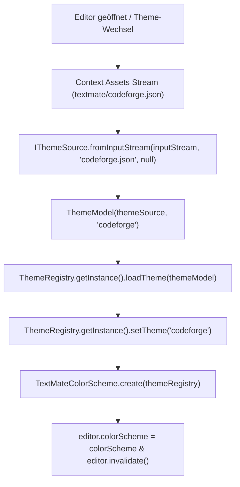

# CodeForge Mobile – TextMate Theme Asset Loading Dokumentation

Diese Dokumentation beschreibt die Umsetzung der Anweisungen aus `todo.txt` zur Einbindung von `codeforge.json` sowie allen weiteren TextMate-JSON-Themes aus dem Verzeichnis `feature/editor/src/main/assets/textmate/`.

---

## 1. Asset Stream Theme Loading (`SoraLanguageProvider.kt`)

Anstatt Dateipfade extern aufzulösen, liest der `SoraLanguageProvider` die JSON-Dateien direkt über den `context.assets` InputStream ein und konvertiert sie über `IThemeSource.fromInputStream` in `ThemeModel`-Instanzen für das Sora-Editor `ThemeRegistry`.

```kotlin
// 4. Load all theme json files (codeforge.json & all textmate json themes)
val themeRegistry = ThemeRegistry.getInstance()
listOf(
    "codeforge", "darcula", "quietlight", "ayu_dark", "ayu_light",
    "ayu_mirage", "eclipse_dark", "eclipse_light", "onedark"
).forEach { name ->
    val fileName = "$name.json"
    val assetPath = "textmate/$fileName"
    runCatching {
        context.assets.open(assetPath).use { inputStream ->
            val themeSource = IThemeSource.fromInputStream(
                inputStream,
                fileName,
                null
            )
            val themeModel = ThemeModel(themeSource, name).apply {
                isDark = !name.contains("light")
            }
            themeRegistry.loadTheme(themeModel)
        }
    }
}
runCatching { themeRegistry.setTheme("codeforge") }
```

---

## 2. Helper-Funktion `applyCodeForgeTheme`

Entsprechend der Spezifikation in `todo.txt` wurde folgende Standalone-/Helper-Funktion in `SoraLanguageProvider.kt` bereitgestellt:

```kotlin
fun applyCodeForgeTheme(editor: CodeEditor, context: Context) {
    try {
        val themeRegistry = ThemeRegistry.getInstance()
        
        // JSON aus den Assets lesen
        context.assets.open("textmate/codeforge.json").use { inputStream ->
            val themeSource = IThemeSource.fromInputStream(
                inputStream, 
                "codeforge.json", 
                null
            )
            
            // Theme-Modell erstellen und laden
            themeRegistry.loadTheme(ThemeModel(themeSource, "codeforge"))
        }

        // Das Theme über den in der JSON definierten Schlüssel "name" aktivieren
        themeRegistry.setTheme("codeforge")

        // Das generierte TextMate-Farbschema auf den sora-editor anwenden
        editor.colorScheme = TextMateColorScheme.create(themeRegistry)
        
    } catch (e: Exception) {
        e.printStackTrace()
    }
}
```

---

## 3. Ablauf-Diagramm (Theme-Initialisierung)


