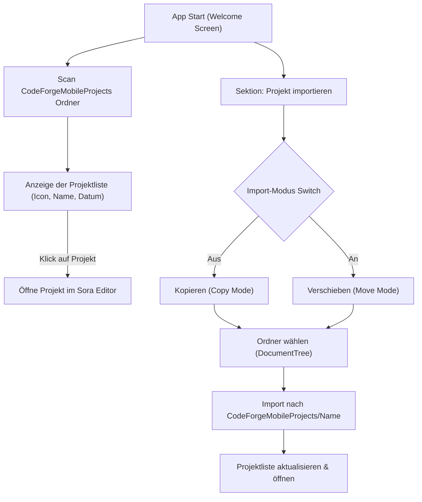

# CodeForge Mobile – Themes & Welcome Screen Import Dokumentation

Diese Dokumentation beschreibt die vollständige Überarbeitung der **Themes & Farbschemata** (in Erscheinungsbild & Editor-Einstellungen) sowie die neuen Features des **Welcome Screens** (Projektliste aus `CodeForgeMobileProjects` & Import-Funktion mit Kopieren/Verschieben Switch).

---

## 1. Themes & Farbschemata Überarbeitung

### A. Vordefinierte System- & TextMate-Themes (`ThemePresets.kt`)
In `ThemePresets.kt` (Modul `:core:designsystem`) wurden alle TextMate- und Editor-Farbschemata als vordefinierte Presets integriert:

- **Dunkle Themes**: `CodeForge Dark` (`codeforge`), `Darcula` (`darcula`), `Ayu Dark` (`ayu-dark`), `Ayu Mirage` (`ayu_mirage`), `Solarized Dark` (`solarized_dark`), `Eclipse Dark` (`eclipse_dark`), `One Dark` (`onedark`), `VS Code Dark+` (`vscode_dark`), `Cyberpunk Neon` (`cyberpunk`), `Wald` (`forest`), `Ozean` (`ocean`).
- **Helle Themes**: `Quiet Light` (`quietlight`), `Ayu Light` (`ayu_light`), `Eclipse Light` (`eclipse_light`), `GitHub Light` (`github_light`), `Notepad++` (`notepad`).

```kotlin
object ThemePresets {
    val codeforge = ThemePreset("codeforge", "CodeForge Dark", "#1E2330", "#6366F1", "#06B6D4", isDark = true)
    val darcula = ThemePreset("darcula", "Darcula", "#2B2B2B", "#BBB529", "#6897BB", isDark = true)
    val quietlight = ThemePreset("quietlight", "Quiet Light", "#F5F5F5", "#7A3E9D", "#005A9C", isDark = false)
    val ayuDark = ThemePreset("ayu-dark", "Ayu Dark", "#0F1419", "#FFB454", "#39BAE6", isDark = true)
    val ayuLight = ThemePreset("ayu_light", "Ayu Light", "#FAFAFA", "#FF9940", "#55B4D4", isDark = false)
    val ayuMirage = ThemePreset("ayu_mirage", "Ayu Mirage", "#1F2430", "#FFCC66", "#5CCFE6", isDark = true)
    val solarizedDark = ThemePreset("solarized_dark", "Solarized Dark", "#002B36", "#2AA198", "#268BD2", isDark = true)
    val eclipseDark = ThemePreset("eclipse_dark", "Eclipse Dark", "#1F1F1F", "#CC7832", "#6897BB", isDark = true)
    val eclipseLight = ThemePreset("eclipse_light", "Eclipse Light", "#FFFFFF", "#7F0055", "#0000C0", isDark = false)
    val onedark = ThemePreset("onedark", "One Dark", "#282C34", "#E06C75", "#61AFEF", isDark = true)
    val githubLight = ThemePreset("github_light", "GitHub Light", "#FFFFFF", "#0366D6", "#28A745", isDark = false)
    val vscodeDark = ThemePreset("vscode_dark", "VS Code Dark+", "#1E1E1E", "#569CD6", "#4EC9B0", isDark = true)
    val notepad = ThemePreset("notepad", "Notepad++", "#FFFFFF", "#0000FF", "#008000", isDark = false)
}
```

### B. Editor-Einstellungen Theme-Vorschau (`EditorSettingsScreen.kt`)
In `EditorSettingsScreen.kt` zeigt `EDITOR_THEME_OPTIONS` nun für jedes Farbschema eine interaktive Vorschau-Karte mit getreuer Darstellung von Syntax-Highlighting (Keywords, Strings, Zeilennummern, Textfarben):

```kotlin
EditorThemeOption(
    key = "codeforge",
    name = "CodeForge Dark",
    isDark = true,
    backgroundColor = Color(0xFF1E2330),
    lineNumberColor = Color(0xFF4C5561),
    keywordColor = Color(0xFF6366F1),
    stringColor = Color(0xFF06B6D4),
    textColor = Color(0xFFF1F5F9)
)
```

---

## 2. Welcome Screen Erweiterungen (`WelcomeRoute.kt`)

### A. Automatische Projektliste (`CodeForgeMobileProjects`)
Beim Öffnen der App werden vorhandene Ordner im zentralen Verzeichnis `/storage/emulated/0/CodeForgeMobileProjects` ausgelesen und in einer strukturierten Liste dargestellt:

- **Icon**: Code/Projekt-Icon mit Primärfarbakzent.
- **Projektname**: Ordnername des Projekts.
- **Erstellungs- & Änderungsdatum**: Formatiert als `dd.MM.yyyy HH:mm`.
- **Interaktion**: Direkter Klick öffnet das Projekt im Haupt-Editor.

### B. Projekt-Import mit Kopieren/Verschieben-Switch
In der Sektion **Projekt importieren** steht eine erweiterte Import-Karte zur Verfügung:

- **Switch-Button**: Wechselt dynamisch zwischen:
  - **Kopieren (Copy Mode)**: Kopiert den ausgewählten externen Ordner rekursiv nach `CodeForgeMobileProjects/<Name>`.
  - **Verschieben (Move Mode)**: Verschiebt den Ordner direkt in das Zielverzeichnis.
- **DocumentTree Launcher**: Löst den System-Ordner-Picker aus und registriert/öffnet das importierte Projekt direkt.

---

## 3. Workflow-Diagramm (Welcome Screen & Import)



---

## 4. Zusammenfassung

- **100% Theme-Synch**: App-Themes & Editor-Themes sind nun vollständig aufeinander abgestimmt.
- **Transparente Projektübersicht**: Bestehende Projekte werden auf dem Welcome-Screen sofort mit Metadaten gelistet.
- **Flexibler Import**: Externe Projekte können per Switch wahlweise kopiert oder verschoben werden.
